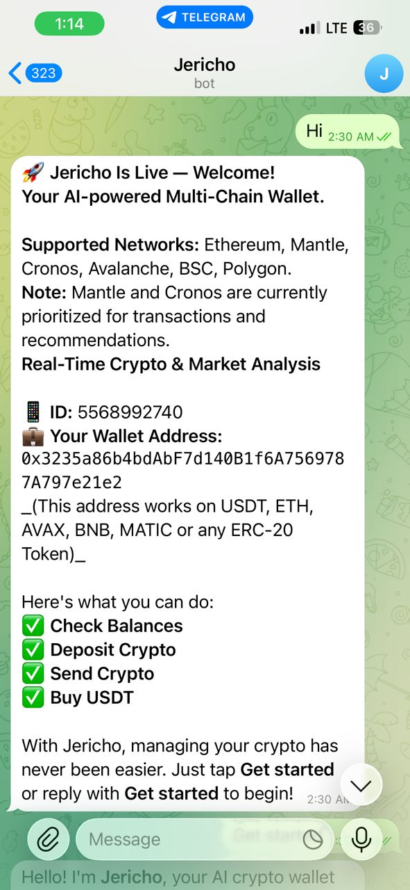
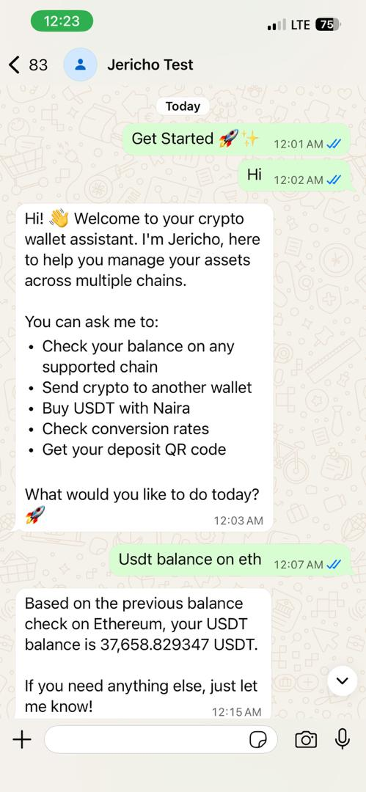

# <p align="center">🚀 Jericho</p>
<p align="center">
  <b>The Future of Multi-Chain AI-Powered Crypto Assistants</b><br>
  <i>Seamlessly manage, transact, and bridge assets through the power of Conversational AI.</i>
</p>

<p align="center">
  
  
  
  
  
</p>

---

## 🌟 Overview
Jericho is a cutting-edge decentralized finance assistant designed for the **Mantle Global Hackathon**. It bridges the gap between complex blockchain protocols and everyday users by providing a natural language interface on the platforms you use most: **Telegram, WhatsApp, and the Web.**

> "Jericho makes crypto as simple as sending a text message."

---

## ✨ Key Features

| Feature | Description |
| :--- | :--- |
| **🤖 AI Commands** | Send crypto or check balances using plain English (e.g., *"Send 0.5 AVAX to 0x..."*) |
| **🌐 Multi-Chain** | Native support for **Mantle, Ethereum, Avalanche**, and more. |
| **📱 Omnichannel** | Full integration with **Telegram Bot API** and **Twilio WhatsApp**. |
| **🛡️ Military Security** | Private keys are encrypted using **AES-256-GCM** with unique IVs and tags. |
| **💳 Fiat Onramp** | Instant onboarding via **Paystack** and **Ramp** integrations. |
| **📊 Smart Dashboard** | A beautiful interactive web interface to track your portfolio in real-time. |

---

## 📸 Visuals & Demos

<p align="center">
  
  <br>
  <i>Jericho – Manage your multi-chain assets at a glance.</i>
</p>

<table align="center">
  <tr>
    <td align="center"><br><b>Telegram Interface</b></td>
    <td align="center"><br><b>WhatsApp Interface</b></td>
  </tr>
</table>

---

## 🛠️ Tech Stack

### **Backend & Database**


### **AI & Intelligence**


### **Blockchain & Payments**


---

## 🚀 Quick Start

### 1. Installation
```bash
git clone https://github.com/Marvellye/crypto-bot.git
npm install
```

### 2. Configure Environment
Create a `.env` file and fill in your secrets.
> [!IMPORTANT]
> Your `ENCRYPTION_KEY` must be a high-entropy 32-byte string for secure wallet management.

```env
# AI & MESSAGING
GEMINI_API_KEY=...
TELEGRAM_BOT_TOKEN=...
TWILIO_ACCOUNT_SID=...

# BLOCKCHAIN & DB
SUPABASE_URL=...
ENCRYPTION_KEY=your_secure_32_byte_key
```

### 3. Run the Engine
```bash
# Start development server
node server.js
```

---

## 🧪 Bulletproof Testing
We take security seriously. Run our automated smoke tests to verify the integrity of the wallet encryption:

- `node tests/decrypt_roundtrip.js` — Verifies encryption/decryption flow.
- `node tests/scan_wallets.js` — Audits the entire database for data integrity.
- `node tests/test_usdt_balance.js` — Tests real-time blockchain data fetching.

---

## 🔐 Security Architecture
Jericho implements **"Encryption-at-Rest"** with zero-knowledge principles:

1. **Wallet Generation**: Random seeds generated server-side with cryptographic strength
2. **AES-256-GCM Encryption**: Each private key encrypted with:
   - Unique IV (Initialization Vector)
   - Authentication Tag for integrity verification
   - ENCRYPTION_KEY from environment
3. **Storage Format**: Only `iv:tag:encrypted` stored in database (never plaintext)
4. **Decryption**: Keys decrypted only in-memory during transactions, never persisted to logs
5. **Key Rotation**: Support for safe key rotation with re-encryption workflow

### Verifying Encryption Integrity
```bash
# Scan all wallets for encryption validity
node tests/scan_wallets.js
```

If issues are found, the report is saved to `tests/wallet_scan_report.json` with details on problematic wallets.

---

## 🗺️ Roadmap
- [ ] **Phase 1**: Cross-chain bridging (LayerZero integration)
- [ ] **Phase 2**: Voice-to-Transaction commands 🎙️
- [ ] **Phase 3**: Non-custodial social login (MPC Wallets)
- [ ] **Phase 4**: Native Mantle dApp ecosystem integration

---

## 🤝 Contributing & Support
Built with ❤️ for the **Mantle Hackathon**. We welcome contributions!

- **Questions or Issues?** Open a GitHub Issue
- **Bug Reports?** Include error logs and environment details
- **Security Concerns?** Report privately to the maintainers
- **Feature Requests?** Describe use cases and expected behavior

---

<p align="center">
  
</p>
